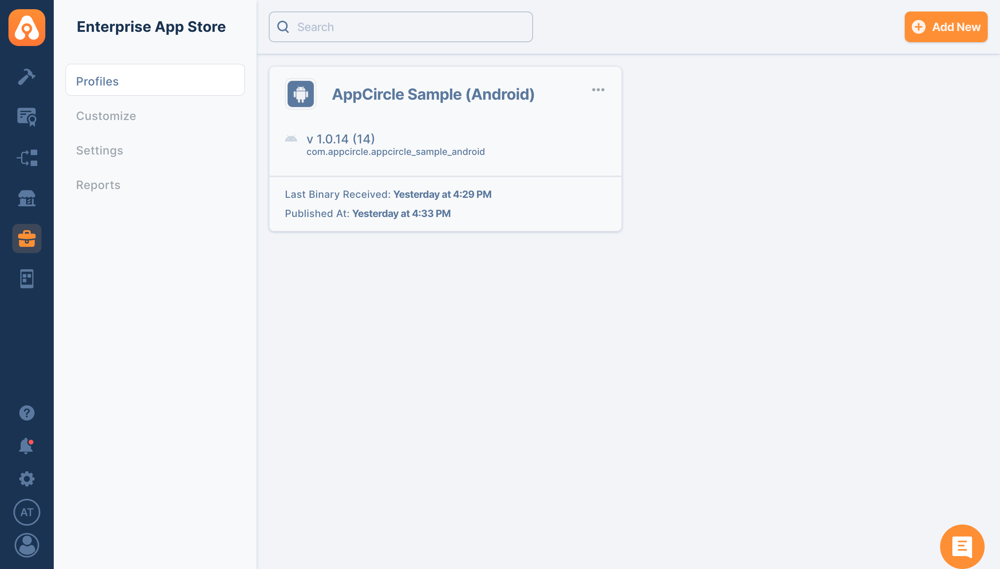

## Appcircle Enterprise App Store

Appcircle Enterprise Mobile App Store is your own mobile app store for providing access to in-house apps with a customizable mobile storefront.

- **Customizable Storefront:** Distribute your in-house apps with a fully customizable mobile storefront.
- **Secure Distribution:** Everything you need for secure, streamlined distribution of your in-house apps.
- **No MDM Required:** Allows distribution of B2B and B2E applications without the need for an MDM solution and enrollment.

Learn more about [Appcircle Enterprise App Store](https://appcircle.io/enterprise-app-store?&utm_source=azure&utm_medium=product&utm_campaign=enterprise_app_store).

## What Sets Apart Appcircle Enterprise Mobile App Store

1. **Direct File Sharing:**
   - **Skip Traditional Stores:** Share .IPA, APK, or AAB files directly, avoiding the need to wait for Apple App Store or Google Play approvals.
2. **Flexible Sharing Options:**
   - **Beta and Live Modes:** Share your app in ‘beta’ mode for testing new features or identifying bugs, or in ‘live’ mode for stable versions. This flexibility helps maintain the development lifecycle without interruptions.
3. **Enhanced Security:**
   - **Secure Authentication:** Access the Enterprise Mobile App Store with extra secure authentication using Enterprise Authentication Methods.
   - **Controlled Access:** Ensure that only authorized users can access the app store and its contents.
4. **Customizable Mobile Storefront:**
   - **Tailored Experience:** Provide a customizable mobile storefront for your in-house apps, ensuring a tailored experience that aligns with your brand and user needs.
5. **No MDM Requirement:**
   - **Simplified Distribution:** Distribute B2B and B2E applications without the need for a Mobile Device Management (MDM) solution or enrollment, reducing complexity and costs.
6. **Streamlined Workflow:**
   - **Seamless Integration:** Integrates smoothly with your existing workflow, making it easy to manage and distribute apps within your organization.
   - **Efficient Management:** Track and manage applications, versions, testers, and teams effectively, ensuring a smooth distribution process.

These features make the Appcircle Enterprise Mobile App Store a powerful tool for securely and efficiently distributing in-house applications, offering flexibility, enhanced security, and a streamlined workflow.



### Generating/Managing the Personal API Tokens

To generate a Personal API Token:

1. Go to the My Organization screen (second option at the bottom left).
2. Find the Personal API Token section in the top right corner.
3. Press the "Generate Token" button to generate your first token.


## How to use Appcircle Enterprise Mobile App Store Extension

### tension

1. Go to your pipeline and search for "Appcircle Enterprise Store."
2. Provide the required information, such as the Appcircle Access Token, and hit the add button to publish your app.
3. After entering the inputs, your pipeline file should look similar to this:

```yaml
- task: AppcircleEnterpriseStore@0
  inputs:
    accessToken: "YOUR_PAT" # Your Appcircle Access Token
    entProfileId: "PROFILE_ID" # ID of your Appcircle Enterprise Mobile App Store Profile
    appPath: "APK_PATH" # Path to your iOS .ipa, or Android APK
    summary: "Summary Notes" # Summary Notes about the version of your app
    releaseNotes: "Release Notes" # Release Notes about the version of your app
    publishType: "Beta" # Publishment type of your app None|Beta|Live
```

### Leveraging Environment Variables

Utilize environment variables seamlessly by substituting the parameters with $(VARIABLE_NAME) in your task inputs. The extension automatically retrieves values from the specified environment variables within your pipeline.

If you would like to learn more about this extension and how to utilize it in your projects, please [contact us](https://appcircle.io/contact?&utm_source=azure&utm_medium=product&utm_campaign=enterprise_app_store)

### Reference

For more detailed instructions and support, visit the [Appcircle Enterprise App Store documentation](https://appcircle.io/enterprise-app-store?&utm_source=azure&utm_medium=product&utm_campaign=enterprise_app_store).
